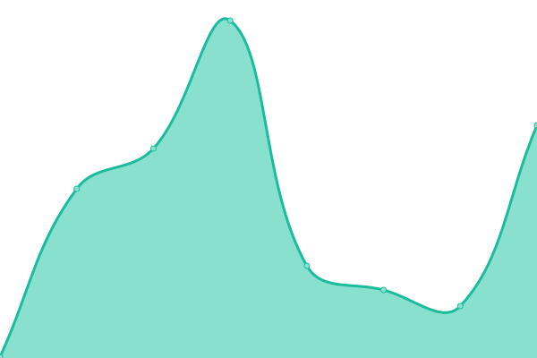
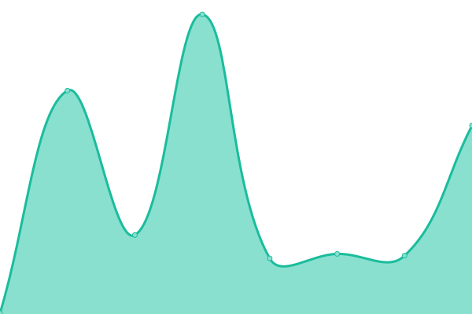

# [📈 Live Status](https://status.getgptapi.com): <!--live status--> **🟩 All systems operational**

This repository contains the open-source uptime monitor and status page for [get-gpt](https://status.getgptapi.com), powered by [Upptime](https://github.com/upptime/upptime).

With [Upptime](https://upptime.js.org), you can get your own unlimited and free uptime monitor and status page, powered entirely by a GitHub repository. We use [Issues](https://github.com/get-gpt/upptime/issues) as incident reports, [Actions](https://github.com/get-gpt/upptime/actions) as uptime monitors, and [Pages](https://status.getgptapi.com) for the status page.

<!--start: status pages-->
<!-- This summary is generated by Upptime (https://github.com/upptime/upptime) -->
<!-- Do not edit this manually, your changes will be overwritten -->
<!-- prettier-ignore -->
| URL | Status | History | Response Time | Uptime |
| --- | ------ | ------- | ------------- | ------ |
|  [Get ChatGPT Home Page](https://getgptapi.com) | 🟩 Up | [get-chat-gpt-home-page.yml](https://github.com/get-gpt/upptime/commits/HEAD/history/get-chat-gpt-home-page.yml) | 

 0ms
     
 | 

<a href="https://status.getgptapi.com/history/get-chat-gpt-home-page">100.00%</a>
    

|  [Get ChatGPT Chat Online](https://chat.getgptapi.com) | 🟩 Up | [get-chat-gpt-chat-online.yml](https://github.com/get-gpt/upptime/commits/HEAD/history/get-chat-gpt-chat-online.yml) | 

 0ms
     
 | 

<a href="https://status.getgptapi.com/history/get-chat-gpt-chat-online">100.00%</a>
    

|  [Get ChatGPT - Backend API](https://i.getgptapi.com/api/v1/ping) | 🟩 Up | [get-chat-gpt-backend-api.yml](https://github.com/get-gpt/upptime/commits/HEAD/history/get-chat-gpt-backend-api.yml) | 

 0ms
     
 | 

<a href="https://status.getgptapi.com/history/get-chat-gpt-backend-api">100.00%</a>
    

|  [Domain - Global Proxy](https://api.getgptapi.com/api/v1/ping) | 🟩 Up | [domain-global-proxy.yml](https://github.com/get-gpt/upptime/commits/HEAD/history/domain-global-proxy.yml) | 

 0ms
     
 | 

<a href="https://status.getgptapi.com/history/domain-global-proxy">100.00%</a>
    

|  [Domain - us-e154412c.getgptapi.com](https://us-e154412c.getgptapi.com/api/v1/ping) | 🟩 Up | [domain-us-e154412c-getgptapi-com.yml](https://github.com/get-gpt/upptime/commits/HEAD/history/domain-us-e154412c-getgptapi-com.yml) | 

 0ms
     
 | 

<a href="https://status.getgptapi.com/history/domain-us-e154412c-getgptapi-com">100.00%</a>
    

|  [Get ChatGPT - Pure Proxy](https://proxy.getgptapi.com/v1/models) | 🟩 Up | [get-chat-gpt-pure-proxy.yml](https://github.com/get-gpt/upptime/commits/HEAD/history/get-chat-gpt-pure-proxy.yml) | 

 0ms
     
 | 

<a href="https://status.getgptapi.com/history/get-chat-gpt-pure-proxy">100.00%</a>
    

|  [Get ChatGPT - Pure Proxy 1](https://proxy-1.getgptapi.com/v1/models) | 🟩 Up | [get-chat-gpt-pure-proxy-1.yml](https://github.com/get-gpt/upptime/commits/HEAD/history/get-chat-gpt-pure-proxy-1.yml) | 

 485ms
     
 | 

<a href="https://status.getgptapi.com/history/get-chat-gpt-pure-proxy-1">99.83%</a>
    

|  [Get ChatGPT - Pure Proxy 2](https://proxy-2.getgptapi.com/v1/models) | 🟩 Up | [get-chat-gpt-pure-proxy-2.yml](https://github.com/get-gpt/upptime/commits/HEAD/history/get-chat-gpt-pure-proxy-2.yml) | 

 0ms
     
 | 

<a href="https://status.getgptapi.com/history/get-chat-gpt-pure-proxy-2">100.00%</a>
    

<!--end: status pages-->

[**Visit our status website →**](https://status.getgptapi.com)

## 📄 License

- Powered by: [Upptime](https://github.com/upptime/upptime)
- Code: [MIT](./LICENSE) © [get-gpt](https://status.getgptapi.com)
- Data in the `./history` directory: [Open Database License](https://opendatacommons.org/licenses/odbl/1-0/)
